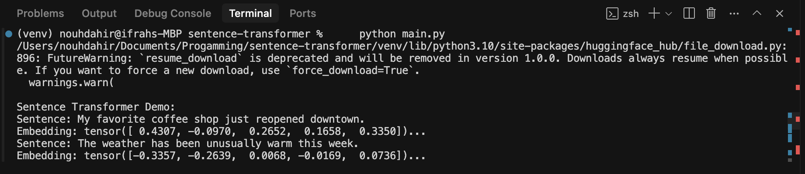
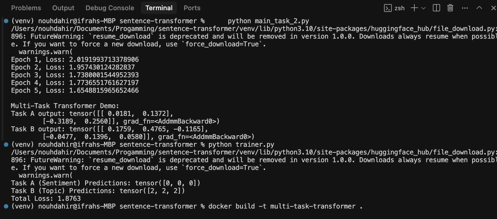
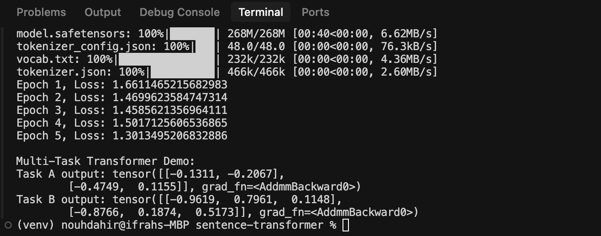

# Sentence Transformers & Multi-Task Learning

## Objective

The goal of this exercise is to assess the ability to implement, train, and optimize neural network architectures, particularly focusing on transformers and multi-task learning extensions. This README provides explanations and justifications for the choices made throughout the assessment.

## Task 1: Sentence Transformer Implementation

### Implementation

We implemented a sentence transformer model using the `distilbert-base-uncased` model from the `transformers` library. This model encodes input sentences into fixed-length embeddings.

### Sample Output

Below are the embeddings for sample sentences:

### Choices Made

- **Model Selection:** Chose `distilbert-base-uncased` for its balance between speed and performance.
- **Library:** Used the `transformers` library for ease of use and pre-trained models.

## Task 2: Multi-Task Learning Expansion

### Implementation

We expanded the sentence transformer to handle a multi-task learning setting with:
1. **Task A:** Sentence Classification (Sentiment Analysis)
2. **Task B:** Topic Classification

### Sample Output

Below are the outputs for the multi-task learning model:

### Changes Made

- **Model Architecture:** Added two linear layers (`classification_head_a` and `classification_head_b`) to the `MultiTaskTransformer` class for the two tasks.
- **Forward Pass:** Modified the forward pass to return outputs for both tasks.

## Task 3: Training Considerations

### Training Scenarios

#### 1. If the Entire Network Should Be Frozen

**Implications:**
- **No Learning:** Freezing the entire network means no parameters are updated during training. The model will not learn from the new data.
- **Use Case:** This scenario is not practical for training a model, as the model will not adapt to the new tasks.

**Advantages:**
- **No Overfitting:** Since no parameters are updated, there is no risk of overfitting to the new data.
- **Consistency:** The model remains in its pre-trained state, which can be useful for consistency checks or baselines.

**Rationale:**
- **Not Recommended:** Freezing the entire network is not a viable training strategy for adapting the model to new tasks.

#### 2. If Only the Transformer Backbone Should Be Frozen

**Implications:**
- **Task-Specific Heads Only:** Only the task-specific classification heads (Task A and Task B) are trained, while the transformer backbone remains unchanged.
- **Use Case:** This scenario is useful when the transformer backbone has already learned rich representations from a large dataset and you want to leverage these representations for new tasks.

**Advantages:**
- **Efficiency:** Training only the task-specific heads is computationally efficient and faster.
- **Stability:** The pre-trained transformer backbone provides stable and robust features, reducing the risk of overfitting.

**Rationale:**
- **Transfer Learning:** This approach leverages the pre-trained knowledge of the transformer backbone while allowing the model to adapt to the specific tasks through the task-specific heads.

#### 3. If Only One of the Task-Specific Heads Should Be Frozen

**Implications:**
- **Single Task Training:** Only one of the task-specific heads is trained, while the other remains frozen.
- **Use Case:** This scenario is useful when one task has more data or is more critical, and you want to focus on improving the performance of the other task.

**Advantages:**
- **Focus on Critical Task:** Allowing one head to be trained while freezing the other can improve the performance of the critical task.
- **Balanced Training:** Helps in balancing the training between tasks, especially when tasks have different data sizes or importance.

**Rationale:**
- **Selective Training:** This approach allows for selective training, focusing on improving the performance of the task that needs more attention.

### Transfer Learning Scenario

#### Choice of a Pre-trained Model

- **Model Selection:** We use `distilbert-base-uncased` as the pre-trained model. This model is a smaller and faster version of BERT, making it suitable for multi-task learning tasks.

#### Layers to Freeze/Unfreeze

- **Freeze Transformer Backbone:** Freeze the layers of the transformer backbone to retain the pre-trained knowledge.
- **Unfreeze Task-Specific Heads:** Allow the task-specific classification heads to be trained to adapt to the new tasks.

#### Rationale Behind These Choices

- **Pre-trained Knowledge:** The transformer backbone has been pre-trained on a large corpus and contains rich semantic representations. Freezing these layers ensures that the model retains this knowledge.
- **Task Adaptation:** The task-specific heads are trained to adapt the pre-trained features to the specific tasks (Task A: Sentiment Analysis, Task B: Topic Classification). This allows the model to learn task-specific patterns while leveraging the pre-trained knowledge.

By following these strategies, we can effectively train the multi-task learning model while leveraging transfer learning to improve performance and efficiency.

## Task 4: Training Loop Implementation (BONUS)

### Implementation

We implemented a joint training loop where both tasks are trained simultaneously. The training loop handles hypothetical data, performs a forward pass, and computes metrics.

### Sample Output

Below is the output from the training loop:

### Assumptions and Decisions

- **Handling of Hypothetical Data:** We used a small dataset of sentences with labels for both tasks.
- **Forward Pass:** The forward pass through the model computes outputs for both tasks.
- **Metrics:** We computed the cross-entropy loss for both tasks and summed them to get the total loss.

## Submission Instructions

- **Code:** Share your code in a well-organized git repository.
- **Docker:** Package it up in a Docker container for extra points.
- **Explanations:** Provide explanations or comments for the steps taken.
- **Task 3 and Task 4:** Include brief write-ups summarizing key decisions and insights.
- **Environment Setup:** Ensure you include a `requirements.txt` file or an equivalent environment setup method so that we can replicate your results.

